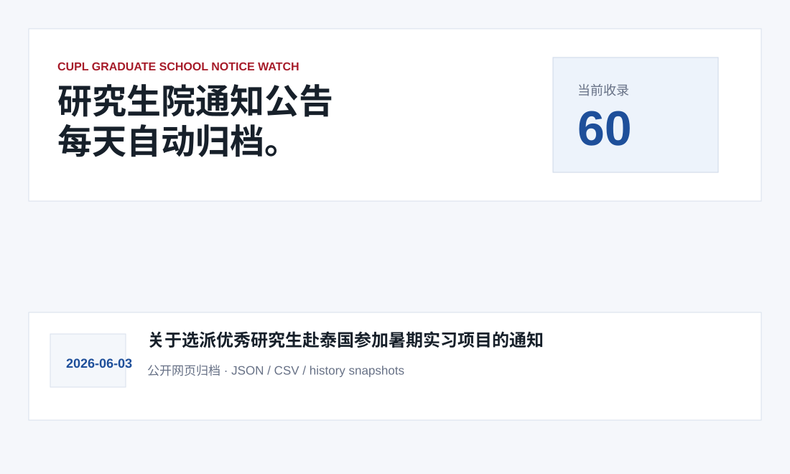
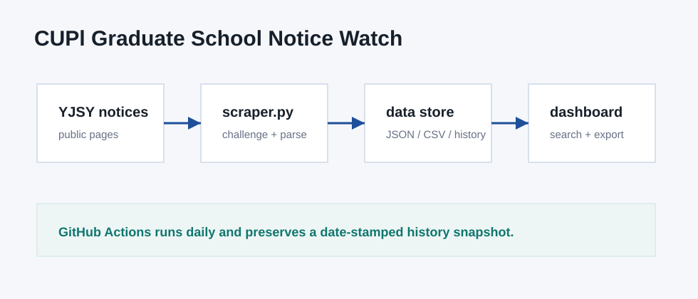

# CUPl Graduate School Notice Watch

[中文文档](README.zh-CN.md)

An unofficial daily archive and dashboard for public notices from the Graduate School of China University of Political Science and Law.



> Disclaimer: this project only archives public webpages. It is not affiliated with China University of Political Science and Law and does not represent official information. Always verify important graduate-school affairs with the official website.

## Target Site

- Site: 中国政法大学研究生院
- Homepage: <https://yjsy.cupl.edu.cn/>
- Notice page: <https://yjsy.cupl.edu.cn/tzgg.htm>

## What It Does

- Fetches notice title, date, link, section, source URL, first-seen time, and last-seen time
- Handles the site dynamic browser challenge before fetching pages
- Keeps `data/notices.json`, `data/notices.csv`, and daily snapshots under `data/history/`
- Provides a static dashboard with keyword search, statistics, and export links
- Runs daily through GitHub Actions and commits changed data files

## Quick Start

```bash
python3 scraper.py 3
python3 -m http.server 8080
```

Open:

```text
http://localhost:8080
```

## Data Files

- `data/notices.json`: merged historical notice database
- `data/notices.csv`: spreadsheet-friendly export
- `data/meta.json`: update metadata
- `data/history/YYYY-MM-DD.json`: notices fetched on each run

## Architecture



## Daily Update

The workflow in `.github/workflows/update.yml` runs every morning and commits changed data files.

## Project Document

The repository includes a Word project document:

```text
docs/project_proposal.docx
```

## License

MIT
